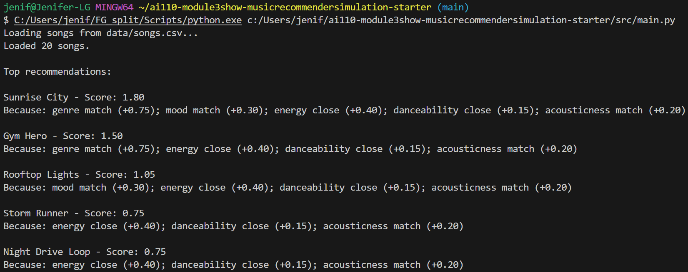
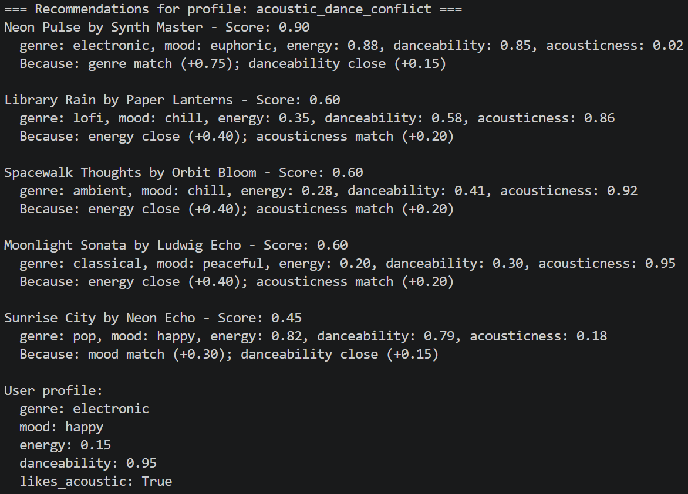
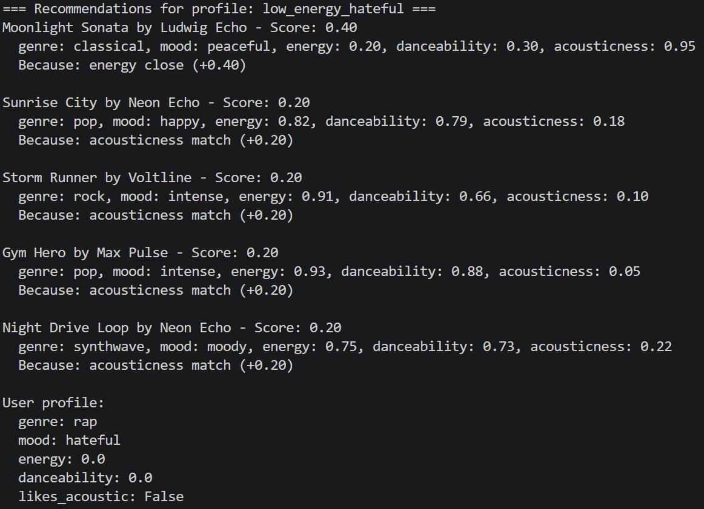
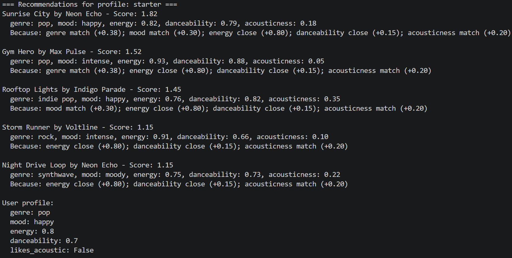
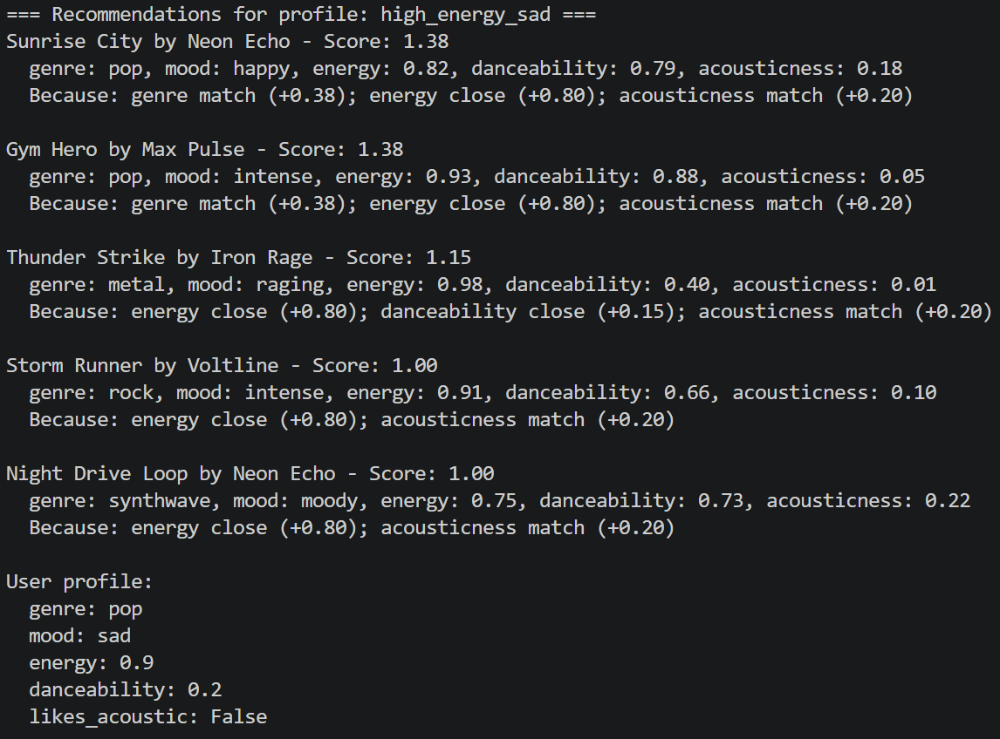
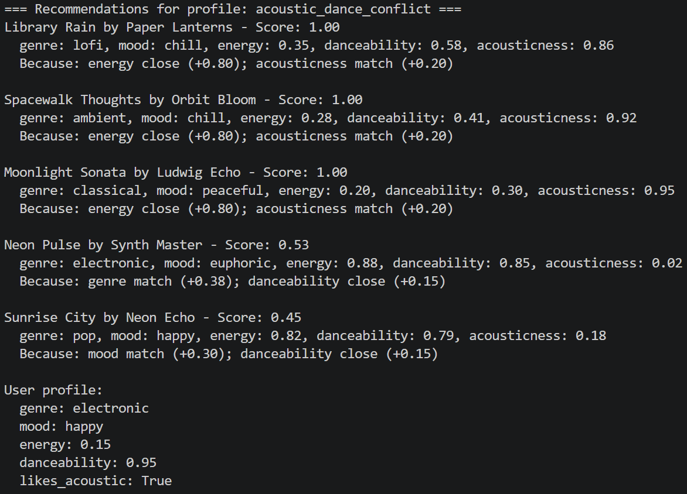
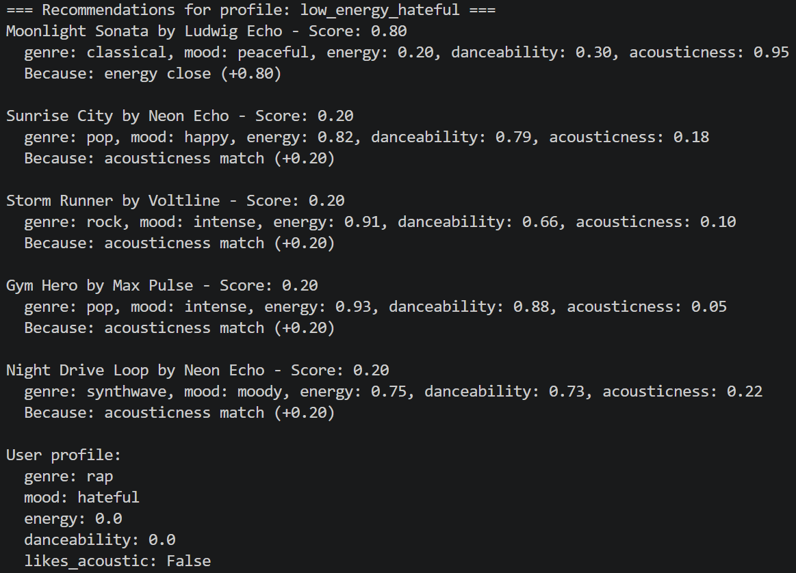

# 🎵 Music Recommender Simulation

Notes:
collab filtering - based on user-item interaction patterns (maybe, like behavior pattern based?); based on behavioral signal

content-based filtering - based on item characteristics and how well they match user tastes. (so maybe like, attribute-based); for new items and better understand of items

User interaction data

explicit feedback: likes, dislikes, ratings, favorites, saved songs/videos
implicit feedback: plays, skips, replays, watch time, completion rate, dwell time
playlist actions: adding/removing tracks, playlist follows, playlist creation
search history and clicks
Item metadata

content tags: genre, artist, album, category
attributes: tempo, mood, key, duration, energy, acousticness
semantic/text data: lyrics, descriptions, titles, transcripts, tags
Context data

time: hour of day, day of week, season
device: phone, desktop, smart speaker
location and language
session state: current queue, recent history, how long user has been active
Social/popularity signals

trending items, charts, popularity scores
what similar users are listening to
social shares, follows, collaborative playlists
Derived or inferred features

user taste profile: preferred genres, artists, moods
item similarity scores
sequence patterns: next-item predictions, transitions
These systems combine many of those data types to decide “what should be recommended next.”

valence - numeric measure of how happy/positive a track feels. Lower = more dark and sad.
Lower acousticness = more electronic feel

## Project Summary

In this project you will build and explain a small music recommender system.

Your goal is to:

- Represent songs and a user "taste profile" as data
- Design a scoring rule that turns that data into recommendations
- Evaluate what your system gets right and wrong
- Reflect on how this mirrors real world AI recommenders

Replace this paragraph with your own summary of what your version does.

---

## How The System Works

Explain your design in plain language.

In summary, the system will compare songs against the user's preferences and recommend songs that are most similar. Songs that more closely match the preferences have a higher score and thus, are more likely to be recommended.

Some prompts to answer:

- What features does each `Song` use in your system
  - For example: genre, mood, energy, tempo

  Each Song is classified by the mood, energy, tempo, valence, danceability, and acousticness as I believe that these traits would reflect the "vibe" of a song and thus, a person's taste in music.

- What information does your `UserProfile` store

The `UserProfile` stores user information such as username, age, gender, preferences (high energy, medium-high danceability, low acousticness), favorite artist, favorite song, etc.

- How does your `Recommender` compute a score for each song
The `Recommender` would compute a score for each song by checking the song against the preferences stated in the user profile (i.e. do a distance calculation between the attribute of the song and the preference stated)
   
Preference levels (on a sliding scale):
- No = 0
- Very Low = 0.05
- Low = 0.20
- Medium-Low = 0.35
- Medium = 0.5
- Medium-High = 0.65
- High = 0.80
- Very High = 1.0

- How do you choose which songs to recommend
The recommended songs would be the songs with the smallest distance from the preferences after the individual distance from each preference has been aggregated (either by sum or mean pooling).

You can include a simple diagram or bullet list if helpful.

---

## Getting Started

### Setup

1. Create a virtual environment (optional but recommended):

   ```bash
   python -m venv .venv
   source .venv/bin/activate      # Mac or Linux
   .venv\Scripts\activate         # Windows

2. Install dependencies

```bash
pip install -r requirements.txt
```

3. Run the app:

```bash
python -m src.main
```

### Running Tests

Run the starter tests with:

```bash
pytest
```

You can add more tests in `tests/test_recommender.py`.

---

## Experiments You Tried

Use this section to document the experiments you ran. For example:

- What happened when you changed the weight on genre from 2.0 to 0.5
- What happened when you added tempo or valence to the score
- How did your system behave for different types of users

When I changed weights, some songs changed positions in ranking, but the list remained mostly the same. I added edge cases and the model was unable to react very well to them as it is rigid.
---

## Limitations and Risks

Summarize some limitations of your recommender.

Examples:

- It only works on a tiny catalog
- It does not understand lyrics or language
- It might over favor one genre or mood

You will go deeper on this in your model card.

Some limitations is that it does not know and account for nuance. It is static and looks for exact matches at times, which can limit the songs that are recommended as some of the same songs get recommended across different profiles.

---

## Reflection

Read and complete `model_card.md`:

[**Model Card**](model_card.md)

Write 1 to 2 paragraphs here about what you learned:

- about how recommenders turn data into predictions
- about where bias or unfairness could show up in systems like this
I learned that recommenders turn data into predictions by scoring the data against the standard given, the user's preferences in this case, and adjusting the scores based on the weights given or learned.
Furthermore, bias can show up as some systems are rigid and account for only a few possibilities. With that, they are biased towards those cases and ignoring whatever they cannot account for. In addition, bias can happen if the training data is imbalanced in favor of one class.


---

## 7. `model_card_template.md`

Combines reflection and model card framing from the Module 3 guidance. :contentReference[oaicite:2]{index=2}  

```markdown
# 🎧 Model Card - Music Recommender Simulation

## 1. Model Name

Give your recommender a name, for example:

> SongRecs 1.0

---

## 2. Intended Use

- What is this system trying to do
- Who is it for

Example:

> This model suggests 3 to 5 songs from a small catalog based on a user's preferred genre, mood, and energy level. It is for classroom exploration only, not for real users.

The system is trying to recommend songs of a similar mood, energy, danceability, based on the preferences stated in the user's profile. It is for people who want to discover new songs that they might like.
---

## 3. How It Works (Short Explanation)

Describe your scoring logic in plain language.

- What features of each song does it consider
- What information about the user does it use
- How does it turn those into a number

Try to avoid code in this section, treat it like an explanation to a non programmer.

The recommender considers genre, mood, energy, danceability, and acousticness -- how non-electronic is the music.
It compares these traits against the preferences stated in the user profile, like favorite genre, target energy level, whether they like acoustic songs, etc.
It scores the songs by awarding points for matches, multiplying by the weights, and adding them all up before ranking them from greatest to least and showing the top k songs.
---

## 4. Data
Describe your dataset.

- How many songs are in `data/songs.csv`
- Did you add or remove any songs
- What kinds of genres or moods are represented
- Whose taste does this data mostly reflect

The dataset is small as it contains 20 songs of a mixture of a variety of genres and moods, from pop to classical as well as reggae, metal, and folk. The moods range from happy to raging, melancholic to romantic and dreamy, along with many other moods. Originally, there were 10 songs, but I had AI generate 10 more songs to expand the dataset.
This data reflects a person who likes music and is open-minded about the different types of music out there. In other words, this suits someone who just wants to vibe along with music.

---

## 5. Strengths

Where does your recommender work well

You can think about:
- Situations where the top results "felt right"
- Particular user profiles it served well
- Simplicity or transparency benefits

The recommender does work well in that it is not sensitive to changes in weights. The explanations are clear and I can see how much each attribute contributed to the score. It works well in happy cases as the mood and/or energy matches.
---

## 6. Limitations and Bias
Where does your recommender struggle

Some prompts:
- Does it ignore some genres or moods
- Does it treat all users as if they have the same taste shape
- Is it biased toward high energy or one genre by default
- How could this be unfair if used in a real product

The recommender struggled with edge cases, where mood and energy, among other attributes conflict with one another. Therefore, the recommendations in those cases do not make sense. It would not match what people would intuitively look for when making recommendations, given those attributes.
Furthermore, it keeps recommending the same songs in some of the profiles, like "Sunrise City". Therefore, it would be unfair if used in a real product as some songs would get unfairly boosted, while others get ignored, even if the preferences match more closely with the user's.
---

## 7. Evaluation

How did you check your system

Examples:
- You tried multiple user profiles and wrote down whether the results matched your expectations
- You compared your simulation to what a real app like Spotify or YouTube tends to recommend
- You wrote tests for your scoring logic

You do not need a numeric metric, but if you used one, explain what it measures.

I checked the functionality of the system by using multiple user profiles and seeing how it behaves in edge cases, or ambiguous situations (e.g. intense, but low energy like Kendrick's diss tracks in 2024. The low energy is likely to favor songs that are more calm and pleasant, rather than intense)

---

## 8. Future Work

If you had more time, how would you improve this recommender

Examples:

- Add support for multiple users and "group vibe" recommendations
- Balance diversity of songs instead of always picking the closest match
- Use more features, like tempo ranges or lyric themes

If I had more time, I would add in more features. Perhaps I could put in a model that learns the user's preferences through behavior (interaction with the app), and adapt future recommendations and weights accordingly. That way, the recommender is more dynamic.

---

## 9. Personal Reflection
A few sentences about what you learned:

- What surprised you about how your system behaved
I'm surprised that even after changing weights, the songs recommended are mostly similar.

- How did building this change how you think about real music recommenders
Real world recommenders are more complex than I thought, especially when it comes to adapting to user preferences while also navigating through ambiguity as some preferences can be contradicting, or behavior can be different than stated preference.

- Where do you think human judgment still matters, even if the model seems "smart"
Human judgment still matters when looking at ambiguous situations or situations that require intuition and feeling.


## Output

<<<<<<< HEAD

### Results of Different Profiles




The majority of the music recommendations do not make sense as they do not account for the edge cases. In fact, the "low_energy_hateful" profile was designed with some of Kendrick Lamar's songs in mind, for when someone wants to vibe with the diabolical pettiness and hate that he has for Drake. Instead of recommending songs with a more negative mood or low energy, most of the recommendations had high energy and/or a more positive mood (peaceful/happy).
### After changing weights of energy and genre





For the most part, the system is not very sensitive to these changes as the most of the same songs were recommended in the same order, most of the time.
=======
>>>>>>> aac77f3 (Enhance README with user profile and recommender details)
